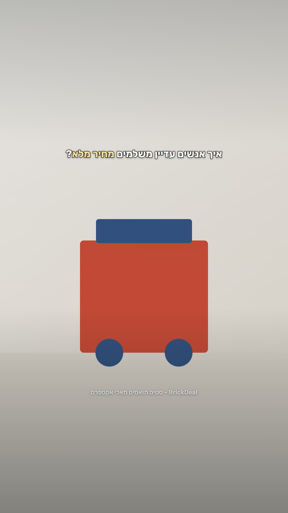
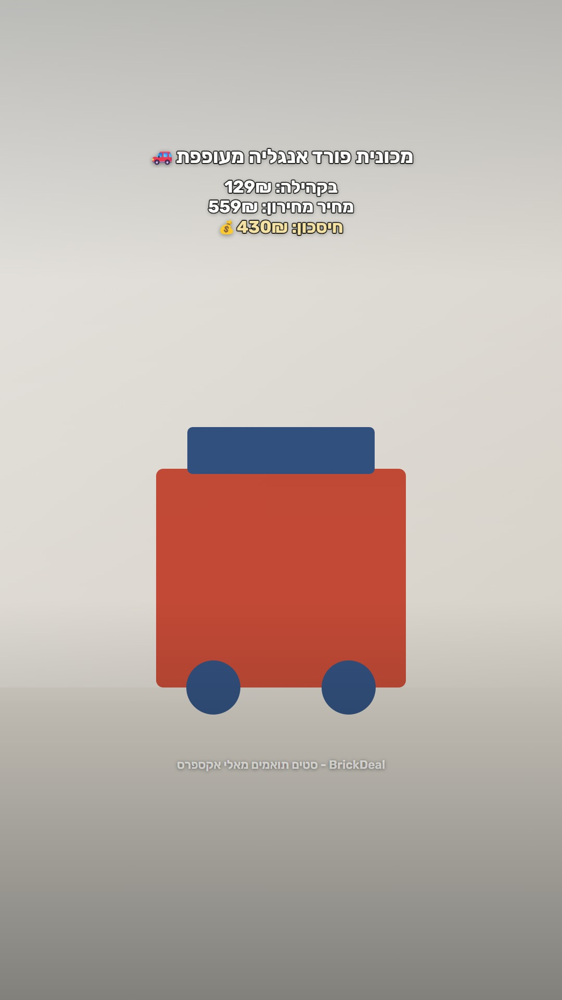
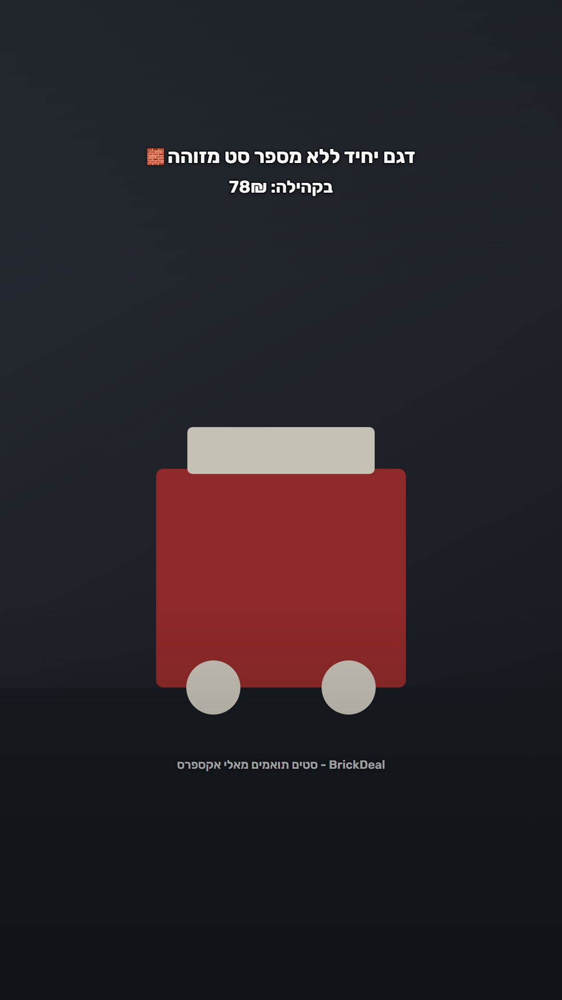

# brickdeal-social

Turns the BrickDeal deal feed into Hebrew TikTok slideshows. It picks five sets,
prices them against the original brand's retail price, photographs them as
though somebody built them at home, renders the slides, and sends them to one
person on Telegram for approval. Nothing publishes without a tap.

```
deals.json → pick five → Brickset + FX → hook → photographs → render
     → Telegram proposal → ✅ → build → Telegram album → ✅ → TikTok + Instagram
```

<p align="center">
  
  
  
</p>

<p align="center"><em>Rendered output, from <code>npm run brick-lab</code>, over the white wall that
is the hardest background and the most common one. Left to right: a cover with
its emphasis in cream, an ordinary slide, and the case where Brickset has never
heard of the set — which carries the price alone and must not look like an
error.</em></p>

The account this is modelled on is [@lego_from_ali](https://www.tiktok.com/@lego_from_ali)
(`בונים וחוסכים-מאלי אקספרס`), which does 120K–200K views on the format with
under five thousand followers. Its anatomy is copied closely and departed from
in exactly one place, which is documented below and enforced in code.

## What a slide is

A photograph filling the whole 9:16 frame — no card, no border, no badge, no
logo chip — with four centred lines near the top:

```
סחלב פרחים 🌸
בקהילה: 45₪
מחיר מחירון: 269₪
חיסכון: 224₪ 💰      ← this line in cream, not white
```

White, bold, with a fine dark outline and a soft shadow. A small
semi-transparent watermark bottom centre, clear of TikTok's own furniture.

**Two treatments were built and the lighter one won.** The first came straight
off the reference: type hard against the right edge in a ~7px black outline,
which is what TikTok's own editor produces. Rendered beside the posts this
channel already publishes it was the louder of the two, and the owner picked the
other — so what is here now is the travel channel's treatment, centred and
finer.

That moves where legibility comes from. At 2px the outline is a definition edge
rather than a border, and the scrim and shadow do the work — which matters,
because a home shot of a white wall in daylight is exactly the background a fine
outline struggles on and the heavy one would not. `brick-lab` renders that case
first for this reason, and `strokePct` in `brick-config.json` dials back to the
heavy version in one line.

**One phrase per cover is set in cream.** Hebrew has no capitals, so a shout has
to be carried by colour. It is one phrase and not the line: if every word is
cream then no word is shouted. On a slide the same colour goes on the saving,
which is the one number the whole post is an argument about. Cover emphasis is
marked with `*stars*` in the config and the model is asked for it by name; the
stars are stripped at load, so one unbalanced marker can never reach a slide.

One post is a **roundup**: five slides, five different sets, five chances to
hook a viewer, and every swipe is a watch-time signal.

## Three decisions that are enforced rather than hoped for

**The trademark never appears.** The reference writes the original brand's name
on every slide (`בחנות של לגו: 269₪`) and spends one of five hashtags on it.
That tag is what this audience actually searches, so keeping the rule costs real
discovery — and the rule was kept, because the same one governs brickdeal-website
and its generated pages, and one vocabulary across the site, the channel and
TikTok is worth more than one tag. `src/brick/copy.js` refuses any slide line,
caption or hashtag carrying it, at build time, so a string that breaks the rule
never becomes something approvable by tapping. One boolean in
`brick-config.json` stands the guard down if the numbers ever argue for it.

The pattern is fussier than it looks and each detail fixes a real case: Hebrew
glues its prefixes on, so `בלגו` and `הלגו` are the trademark; `דלגו` is an
ordinary verb and is not; `לגור` and `לגוף` are common words that open with the
same three letters; and in Latin a trailing `\b` would miss "LEGOs" while
dropping the leading one matches "allegory".

**No retail price means no comparison.** The middle line comes from Brickset,
keyed by set number, preferring the German price because it includes VAT and
Israel has VAT — the American one does not and is quietly about 17% flattering.
It is converted at an ECB rate that is fetched once per deck and **stored on the
deck**, so a slide's number can still be checked six weeks later.

When Brickset has never heard of the set — which happens often, because set
numbers are scraped out of seller titles — the slide carries the price alone and
says nothing about what the set is worth. That is a correct slide, not a broken
one. The same posture governs the feed's own `originalPrice`, which was
considered for this job and rejected: it is a marketplace strike-through, not a
price anyone ever charged.

**A slide has no warning band.** brickdeal-website renders a stale or
placeholder deal with a red band and a dimmed date; the reader can see something
is wrong and the page is still honest. Once a price is on TikTok it cannot be
dimmed, corrected or taken down quietly. So `src/brick/feed.js` refuses where the
site merely warns: a placeholder affiliate link, a price nobody has checked, a
price last checked more than fourteen days ago.

## The photographs

This is the hardest part of the format to automate, and the reason it works.

The reference's pictures are his own builds on his own shelf — white wall,
daylight, other sets in the background. A marketplace catalogue image will look
like a catalogue image regardless of the overlay. So the product photo is
restaged by an image model using the prompt from the `brickdeal-product-shot`
skill, where every constraint in it was added to fix a real failure.

Three rules, in `src/images/homeShot.js`:

1. **Build from the photo of what the link sells**, not the nicer official
   render of the original set. The feed carries both — `sourceImage` present
   means `image` was swapped for a render — and the seller's photo wins. A post
   showing one product while the link sells another is what causes refunds and
   affiliate complaints, whatever the caption says.
2. **Check what came back.** A cheap vision call compares the generated photo
   against the original and has to agree it is the same build. Any failure — no
   key, an API error, an unparseable answer — is a "no", never a pass.
3. **Never substitute silently.** A failure falls back to the catalogue photo
   with its provenance *changed*, and the approval card prints it. The decision
   to publish one anyway is made by a person looking at it.

The approval card also says when a deck carries generated photographs, because
the post then has to be labelled as AI-generated in the app and nothing here can
do that for you.

## Two taps, and what sits between them

```
proposal (free)  →  ✅  →  hook + photographs + render  →  album  →  ✅  →  publish
```

The first card is the **proposal**: the recipe, the five sets, and every price
claim the deck will make. Everything in it is free — the feed is a file, Brickset
is cached, the rate is one call a day — so rejecting it costs one message.

What the second tap buys is a model call and one generated photograph per slide,
which is the slowest and least predictable step in the pipeline and the one most
worth not spending on a post nobody wanted.

Unlike the travel pipeline this grew out of, the proposal is not a plan that the
build might not keep. Every set on it is already in the feed and already priced,
so what it names is what the slides will carry.

## Three ways to choose five sets

`src/brick/recipes.js`, in the order they are tried when nothing is asked for:

| | |
|---|---|
| **theme** | one theme's best current deals — the most specific post available, so the best one when it is available at all |
| **savings** | the largest real savings on the feed, whatever they cost |
| **price** | everything under a ceiling, walking the ceilings upward so `5 סטים עד 100₪` is the tightest true claim rather than a safe round number |

There is also a **single-set** post, and it is the one place the format departs
from the reference structurally: with only one price block to show, repeating it
five times is not a post. So the set appears once with its prices and the
remaining slides carry one short fact each, drawn from what the feed actually
knows.

**The order within a deck is not a plain sort.** The strongest slide goes first,
where it decides whether anybody swipes, and the second-strongest goes *last*,
where it decides whether anybody follows.

## Running it

Requires Node 18+ (developed on 24) and no build step.

```bash
npm install
npx playwright install --with-deps chromium
cp .env.example .env      # then fill it in
npm test                  # 180 offline checks, no credentials needed
npm run brick-lab         # look at the slides, ~15s a round
npm run brick-once -- --fixture --no-images   # the whole path, publishing nothing
npm start
```

Slides cannot be reviewed by reading the HTML. Hebrew shaping, bidi, whether
`1,234₪` lands on the correct side of its label, whether a heavy outline closes
the counters of Arimo at 45px, whether white type survives on a white wall — all
of it happens at render time. Two scripts exist to look at them:

- **`brick-lab`** renders hand-written fixtures over three synthetic
  backgrounds. The fixtures are the cases that actually break: a two-word name,
  a name past two lines, Latin inside Hebrew, a four-figure saving, and a slide
  with no comparison at all. The backgrounds are a white wall in daylight (the
  worst and the most common), an oak shelf, and a dim bedroom. No model calls, no
  network, no keys. **The white-wall column is the one to look at** — it is where
  a fine outline gives out first.
- **`brick-once`** is the whole pipeline — feed, Brickset, FX, cover,
  photographs, render — written to `out/brick/` with a contact sheet, every price
  claim printed with its source, and nothing written to the store. `--fixture`
  generates a feed with today's dates so it works offline; `--no-images` skips
  the expensive step.

TikTok is connected once with `npm run tiktok-token`.

## Why TikTok posts are drafts

TikTok's photo API has no field for a sound. `auto_add_music` is a boolean — on,
and TikTok picks a track you never see; off, and the post is silent, which costs
reach. There is no `music_id` and no endpoint exposes an account's saved sounds,
so "use one of my sounds" cannot be built at either end. Sound is also the one
thing that cannot be changed after publishing.

So `post_mode: MEDIA_UPLOAD` delivers the slides to the account's TikTok
**inbox** — not the Drafts folder on the profile, which is the first place
anyone looks and the one place it will not be — and you finish it in the app:
sound, cover, caption, then post.

Three of TikTok's rules stop applying in that mode, none of them by choice: no
privacy level to resolve, no unaudited-client restriction, and no daily cap,
because all three govern posts the *client* makes and here it makes none.

The cost is that it is not unattended. A deck waits in your inbox until you open
TikTok, and nothing here can tell whether you ever did — so the notification
says `📥 טיקטוק: נשלח לטיוטות — עוד לא באוויר`, because "posted" is the one
wrong thing to say about a post that still needs you.

**Scopes are per mode, not per media type.** `video.publish` is direct posting;
`video.upload` is the inbox. Asking for the wrong one fails at `init` with
`scope_not_authorized`, and a token cannot gain a scope by refreshing.

## Commands

`/deck` build one now · `/deck harry-potter`, `/deck 100`, `/deck בונסאי` name
it · `/status` · `/health` every destination separately, with its last error ·
`/usage` tokens and cost · `/igquota` · `/tiktok` connection, tokens, granted
scopes · `/tiktok_connect` · `/pending` · `/queue` what is waiting, numbered ·
`/next` publish the next · `/post 3` publish that one out of turn · `/held`
`/retry` `/clear_held` `/resend`

**The bot talks like a CLI.** A command prints what you asked for; the daemon
does not chatter. Messages that arrive unasked are one line, and the detail
lives behind `/status` and `/health` where you go looking for it. Failures and
things waiting on you are the exception, because they change what you would do
next.

**The owner is not rate-limited by any of this.** Every guard here protects the
feed from the pipeline, not from the person who owns it, who can already post
anything by hand. So an owner-triggered deck steps over them — and names each
one it stepped over, on the card, before you tap.

## Layout of the code

| Path | What it does |
|---|---|
| `bot.js` | Telegraf bot: owner lock, proposals, staging, approve/reject, queue, drip |
| `brick-config.json` | the editorial dials: price labels, caption pool, cover hooks, hashtags, type |
| `src/brick/feed.js` | the deal feed, and **what is allowed out of it onto a slide** |
| `src/brick/rrp.js` | the comparison price, off Brickset, and every reason not to make one |
| `src/brick/fx.js` | one exchange rate per deck, with the date it was published on |
| `src/brick/copy.js` | **the guards** — the trademark, the em dash, the URL, the bidi on a price |
| `src/brick/recipes.js` | which five deals, and in which order |
| `src/brick/build.js` | the two halves: the free proposal, and the expensive build |
| `src/brick/proposal.js` | the first card — what this post would be, before paying for it |
| `src/brick/candidate.js` | a built deck wrapped for the approval queue |
| `src/brick/caption.js` | the caption and the five hashtags, drawn once for both platforms |
| `src/brick/emoji.js` | the one emoji beside a set's name — a fixed map, not a free choice |
| `src/brick/themes.js` | theme detection, ported verbatim from the bot and the website |
| `src/images/homeShot.js` | the generated photograph, and the check that it is the right set |
| `src/render/brickSlide.js` | the slide: the frame, the block, the outline, the watermark |
| `src/render/brickDeck.js` | a deck to JPEGs, at both sizes |
| `src/publish/` | Instagram Graph API, TikTok Content Posting API, publish targets |
| `src/store.js` | one JSON file: dedupe, proposals, staging, queue, publish log |

## Honest caveats

**Brickset's coverage of clone set numbers is unmeasured.** A `setId` scraped
from a seller title is often wrong — `brickdeal-automation/src/polish.js`
documents this — so some share of slides will carry no comparison. How large a
share decides how often the format's main hook is available at all, and it is
worth measuring against the real feed early. The proposal card prints the count
for exactly this reason.

**A converted list price is not an Israeli shelf price.** It is the original
brand's recommended retail price in Germany, converted at an ECB rate. The slide
calls it `מחיר מחירון`, which is what it is, and the rate and its date travel
with the deck so the claim can be checked. It is not the number the reference
account uses — theirs is looked up by hand, per set, and there is no API for it.

**The generated photographs are the least predictable step.** The product-shot
skill carries a list of failure fixes that a person applies after looking at the
output, and that is not something this can do: the second attempt is the same
prompt against a stochastic model, so there is no third. The vision check plus a
cached, regenerable shot per product is the mitigation, and the fallback chain
degrades to the catalogue photo and says so.

**The freshness rule is only as good as the refresh job.** Everything on a slide
is as true as `deals.json` was when it was read. If
`brickdeal-automation`'s nightly price re-check dies, this stops producing decks
after fourteen days — which is the intended behaviour and is also the only
signal it gives.

**The trademark rule costs discovery, deliberately.** `#לגו` is what this
audience searches and the reference spends a slot on it. See `copy.allowTrademark`.

## Security

- Every credential lives in `.env`, which is gitignored along with every
  `.env.*` variant. Nothing else reads one.
- `data/` is gitignored, so cloning this does not leak what has been posted or
  what has been generated.
- The bot checks `ctx.from.id` against `OWNER_ID` in middleware registered
  before every other handler, and refuses to start without it. A missing config
  value fails closed rather than opening the bot to whoever finds the username.
- It also refuses to start with no publish destination configured — an approval
  queue with nowhere to publish silently eats what you approve.
- The feed is parsed as JSON and never evaluated. The one place HTML is rendered
  is our own slide templates, where every interpolated value goes through
  `escapeHtml()`.
- Telegram messages are sent without `parse_mode`. A set name containing a stray
  `*` would otherwise break Markdown parsing and drop the message — which, for
  an approval card, means silently not asking.

## Licence

Not currently licensed for reuse. The bundled fonts — TikTok Sans, Arimo,
Assistant and Heebo, the same four the travel channel's slides are set in — are
each under the SIL Open Font License, as is the Noto emoji artwork. Only two of
those licence texts are in `assets/fonts` (`OFL.txt` covers Heebo,
`OFL-Assistant.txt` covers Assistant); TikTok Sans's and Arimo's are still
missing and should be added before anything here is published under a licence.
